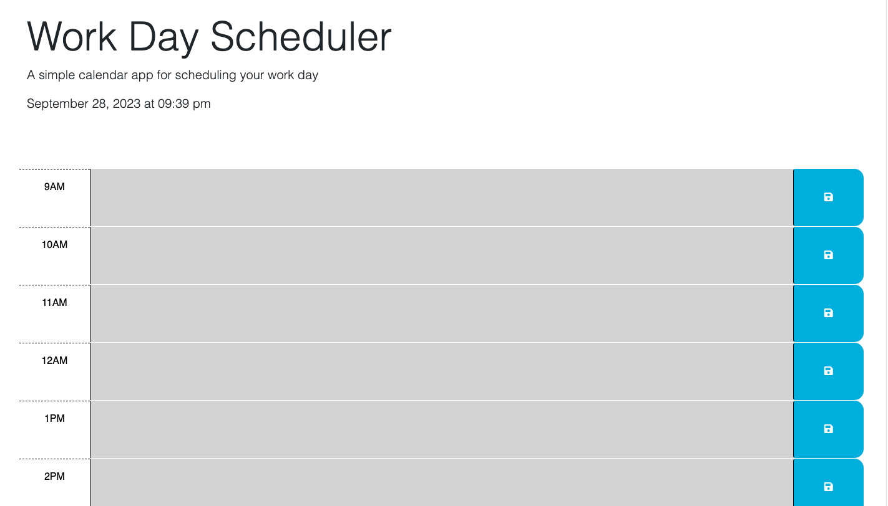

# Liz Makes a Calendar App

##Discription
This is a calendar app where daily work can be scheduled. It features a clock that displays the current date and time as wel as color-coded time blocks that change dynamically according to the time of day.

This project gave me practice working with 3rd party APIs like jQuiry and Bootstrap.

##Usage
This app can be accessed at the URL https://lizfischstix.github.io/liz-makes-a-calendar-app

##License 
MIT license